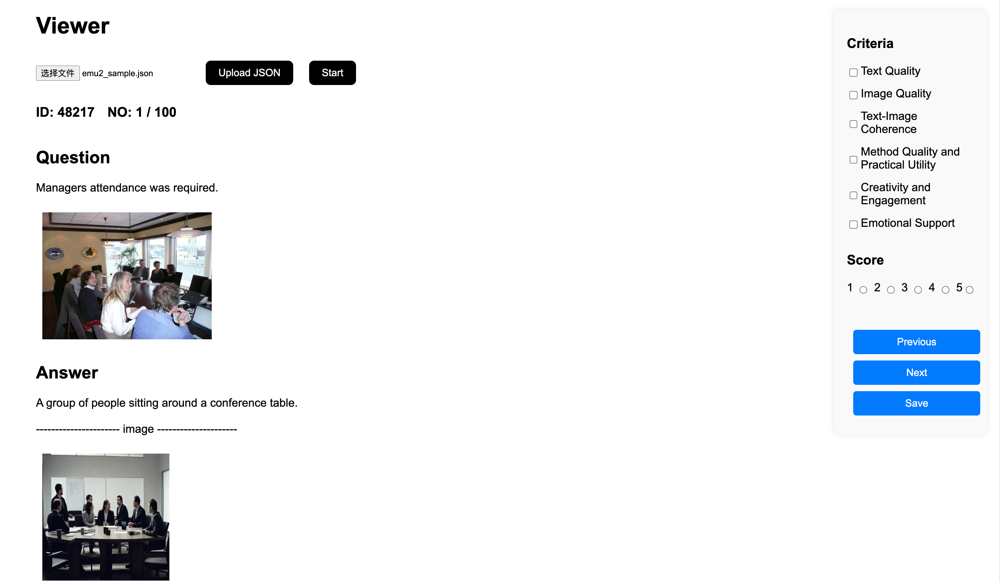

# Many to Many Viewer
This is a web viewer based on `flask` to help you annotate data easier.

### Environment
```bash
pip install flask
pip install argparse
```
### Data

```bash
cd Viewer
git lfs install
git clone https://huggingface.co/datasets/Lillianwei/ManytoMany_sample static
```
Be sure the name of the folder is renamed to `static`.

### Run
1. Select the dataset you want to view. 
    - vist
    - wikihow
    - remi
    - mathvista

    ```python
    python viewer.py <DATASET>
    ```

2. Open `http://127.0.0.1:5000` in your favourite browser.
Choose the json file and click both `Upload JSON` and `Start`.
If everything is fine, you can see the data shown as below.


3. Use the floating panel on the right to check criteria and give score.

4. Click each of those blue buttons can save your current viewer data.

5. You can find the view results in `Viewer/output`.

